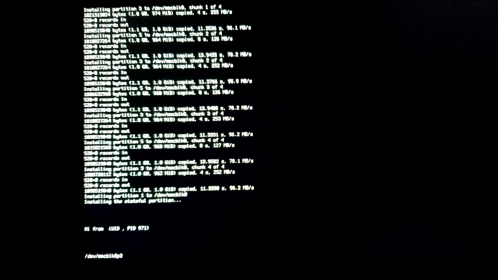

# BadRecovery writeup (extended version)

[Home](https://github.com/BinBashBanana/badrecovery)

Last updated: 2024-10-06 7:07 PM PDT

ChromeOS recovery images are official tools signed by Google that consumers can install on a USB drive to reinstall ChromeOS onto
Chromebooks and Chromeboxes in case something goes wrong.
In March 2024, I thought I'd familiarize myself with how ChromeOS recovery images work.
I knew that they composed of 3 main steps; initramfs (verification), the installer, and post-install (referred to as postinst).
What I did not know were the internal functioning of these parts.

I started by examining the initramfs. The initramfs is the first filesystem loaded by the kernel,
used in most linux operating systems today. The recovery initramfs source code is hosted at the repository
[here](https://chromium.googlesource.com/chromiumos/platform/initramfs/+/HEAD/recovery).
The recovery initramfs's job is to verify that the next step of recovery images, the installer, is official and hasn't been tampered with.  
\* Note: the recovery initramfs does let users modify it, but only if the device does not have developer mode blocked (i.e. not enterprise enrolled).

It has been generally accepted that the recovery initramfs is a secure and complete system, and I wasn't able to find any bugs.

After verifying the rootfs where the installer lives, the initramfs chroots into the rootfs and executes the installer.
The installer source code is hosted at the repository [here](https://chromium.googlesource.com/chromiumos/platform2/+/HEAD/installer).

The job of the installer (chromeos-install) is to copy the partitions from the recovery USB drive to the internal disk of the device.
It then executes the post-install script (postinst) and finishes recovery after that is complete.

I quickly noticed an issue. For some reason, the installer was copying partitions to the host disk's parent block device at specific offsets,
rather than using the partition block devices. The script also did not check if the size of the source data was larger than the size of the
destination partition for a specific few partitions, potentially resulting in overflows. These partitions were:

- KERN-B. This would not work due to the whole partition being hash checked by the initramfs.
- MINIOS-A/B. This was out of the question due to only being supported on the newest devices at the time.
- And ROOT-A.

ROOT-A is the rootfs that is verified by the initramfs and contains the chromeos-install script.
It is verified using [dm-verity](https://docs.kernel.org/admin-guide/device-mapper/verity.html).
However, it only verifies the *filesystem*, not the entire partition. This means that we could potentially expand the partition
to overflow arbitrary data into other partitions.

As the partition table of the internal disk is reset to a factory state before anything is copied to it,
the only thing to figure out now was the offset from ROOT-A to other partitions.
It should be noted that chromeos-install copies the ROOT-A partition of the recovery drive to both ROOT-A and ROOT-B of the internal drive.
The redundancy is a measure in ChromeOS designed to make auto-updating easier, and safer as there is always an older one to roll back to
in case something goes seriously wrong.

Back on topic, there are 3 different base disk layouts that ChromeOS devices can use.

- The [legacy disk layout](https://chromium.googlesource.com/chromiumos/platform/crosutils/+/HEAD/build_library/legacy_disk_layout.json),
which was used on devices manufactured up through 2020
- [Disk layout v2](https://chromium.googlesource.com/chromiumos/platform/crosutils/+/HEAD/build_library/disk_layout_v2.json),
which was used on devices manufactured between 2019 and 2024
- [Disk layout v3](https://chromium.googlesource.com/chromiumos/platform/crosutils/+/HEAD/build_library/disk_layout_v3.json),
which is used on devices manufactured in 2022 or later.

The difference between the first 2 is negligible; the default size of the rootfs partitions was changed from 2 GiB to 4 GiB.
The v3 disk layout reorders some partitions, and adds new partitions (MINIOS-A/B and POWERWASH-DATA).

While looking at the layouts (primary legacy and v2), you may notice that the user data partition (STATE/stateful) is situated
immediately after ROOT-A. Great, that means we can overflow data from ROOT-A into stateful, right? Well, kind of.

An optimization was added to chromeos-install in [r86](https://crrev.com/c/2330304), which splits the rootfs copied from the USB drive to the internal drive into 4 chunks.
This allows the recovery process to be faster overall, as it takes advantage of the disk cache to avoid copying the same data twice.
(As remember, ROOT-A of the USB drive is copied to both ROOT-A and ROOT-B of the internal disk)
However, this creates an issue. While we can still overflow data into stateful, ROOT-A ends up with an exact copy of the data on stateful.
This makes the system unable to boot into ChromeOS after recovery, as ROOT-A is always first rootfs booted after recovery.

  
Chunks being copied to the disk in a normal recovery image, and chunks being copied to the disk when ROOT-A has been expanded.
And a turtle.

So, in other words, arbitrary data could be written to the stateful partition on r85 recovery images or older.
Or, a rather inconvenient workaround could be used: expanding ROOT-A on the USB drive by 4x.
This is inconvenient because ROOT-A goes from 4 GiB to 16 GiB, or 2 GiB to 8 GiB on older devices with smaller rootfs partitions.
This makes the total image size up to 17 GiB.

Now each of the 4 chunks are 4 GiB (or 2 GiB on older devices), which allows data to be written to the stateful partition without also
being written to ROOT-A. A second inconvenience of this workaround is the need to watch the recovery log on VT3 while it is being installed,
so that the device can be restarted early to avoid potentially corrupting the backup GPT table on small internal drives.

Now, with the ability to write arbitrary data to the stateful partition, there is one obvious way forward: [CryptoSmite](https://github.com/FWSmasher/CryptoSmite).

## Persistence

CryptoSmite is an exploit used to persist encrypted stateful (referred to as encstateful) data through TPM clears.

To explain this:  
The *unencrypted* portion of stateful does not contain any sensitive user data, rather being used to store some non-sensitive system data, a location to store packages
installed through dev_install or [chromebrew](https://github.com/chromebrew/chromebrew), as well as the encrypted stateful filesystem block file.  
The *encrypted* portion of stateful contains user data (/home) and variable system data (/var).

The key for encrypted stateful (encstateful) is stored in the TPM, and is lost whenever the system switches from verified mode to developer mode or the other way around.
(The recovery initramfs also clears the TPM manually during recovery.)
When this happens, the system "clobbers" the stateful partition (also known as a "powerwash") to regenerate keys and restore encstateful to a fresh state.

CryptoSmite uses a backup key, `encrypted.needs-finalization`, to persist encstateful data across TPM clears, as this key does not rely on a key in the TPM.

With persisted encstateful data, CryptoSmite sets the `EnrollmentRecoveryRequired` flag to true in the "Local State" file, which is stored on encstateful and is used to
remember the current state of the device and local accounts that have been added to the device.  
The `EnrollmentRecoveryRequired` flag allows a device with forced re-enrollment (FRE) to bypass the check, and unenroll.

CryptoSmite is patched in ChromeOS r120 and higher, so it would not be of any use to currently supported devices.
However, it could be used to unenroll almost every EOL device (at the time of writing this).

Another potential option would be to try to get some kind of code execution persistence, which Rory McNamara has discovered a few of in the past.

The first thing I tried was his chronos (non-root account) persistence via custom device policy. (https://crbug.com/1072233)
I created a script that would be called by chrome when it reads the device policy.
The script would relaunch chrome with the `--ui-show-fps-counter` command line flag so it would be easy to tell if my code was running.

Success!

Note that there is a gap here where I discovered the "main" part of this exploit.
Skip ahead to [postinst exploit](#postinst-exploit) if you want to read chronologically as I was discovering this.
(This doesn't make sense for the purpose of the writeup, so I suggest you read it in order.)

The next step was to get an interactive shell. I was able to borrow some command line flags from
[factory test mode](https://chromium.googlesource.com/chromiumos/platform/factory/+/HEAD/init/goofy.d/chrome_dev.conf)
to get chrome to relaunch with a custom crosh kiosk app that I put on the injected stateful partition
(similar to [chrwn](https://github.com/luphoria/chromeos-rootable/blob/master/chrwn.zip) by luphoria).

It works! And I can use the privilege escalation that I "made" a year ago. (I combined several of the vulnerabilities that Rory had found into one chain.)
If you're curious, that file can be found [here](https://github.com/luphoria/chromeos-rootable/blob/master/privesc/privesc-80-hyperskid-v3.sh).

Some issues with this are that it only works up through [r81](https://crrev.com/c/2162859), and the privilege escalation chain is somewhat flimsy.
(I could never get it to have errors but other people have.)
The privilege escalation chain also further constricts the working versions to between r75(?) and r81.

Later, as I was looking through Rory's vulnerability reports again, I saw 2 that seemed potentially useful:
- [root persistence](https://crbug.com/1252074) using an arbitrary bind mount to get root command execution on every boot
- [root privilege escalation](https://crbug.com/1305267) featuring *disk access to root command execution*

The first may seem perfect, though unfortunately it only works on a specific release of r93, one which doesn't even have a recovery image.

The last part of the second report, "disk access to root command execution", was also interesting. "Disk access" here meant access to certain directories on
stateful and encstateful, which we have full control over. The only issue is that, replacing `/var/cache` with a symlink as done in the bug report, chromeos_startup
detects the anomaly and and clobbers stateful on boot. (This is not an issue in the bug report because it is not being used for persistence, rather only being used
while the system is already running).

However, before [r90](https://crrev.com/c/2696308), it turned out to be possible to use `/var/cache/external_cache` as the symlink, which did not interfere with chromeos_startup.
It may be interesting to note that the ChromiumOS LSM actually enabled this to work, as it causes the `-d "${TO}"` to return false (`${TO}` is the symlink to the directory).
Read Rory's report for more info on this vulnerability.

  
`sleep 1337` is the command run by encrypted_import here

## Postinst exploit

So, I didn't actually read all of chromeos-install. I had missed one key detail, which was this:  
Postinst runs off ROOT-A on the internal disk, mounted without any verification.

Above, I said that due to the change introduced in r86, ROOT-A on the internal disk would end up being the same filesystem as the one on stateful when overflowed.
Of course, we could ignore what happens to stateful, and place an executable at `/postinst` in the overflowing filesystem.

And this was the result:  
  
(sorry for the low quality, this was screenshotted from a video)

This best part is that this works on the latest version (at the time),
and could even be used to unenroll an enterprise enrolled device with developer mode blocked on the latest version.

However, a problem arose:  
The bug where ROOT-A gets overflowed into doesn't occur on devices with disk layout v3.
But, stateful can still be overflowed into. (Note: an extra 4 MiB offset is added to account for the POWERWASH-DATA partition.)
Additionally, many of these devices are using LVM stateful. I don't know the reason for making the stateful partition use LVM on some of these new devices,
as the old system already works fine.

Anyway, when chromeos-install installs the stateful partition, instead of copying the filesystem directly;
it whitelists a specific few directories to copy from the USB drive onto the internal disk.
By placing a symlink in the stateful partition beforehand (by overflowing ROOT-B) that points to the ROOT-A (3rd) partition of the internal disk in /dev,
we can once again copy an arbitrary filesystem containing a custom `/postinst` to the internal storage before it gets run.

And one more thing - it turns out that there wasn't a block_devmode check in recovery images until [r42](https://crrev.com/c/202250), which allows us to modify
recovery images in the "intended" way and still have them boot with developer mode blocked. This only applies to very old devices that have r41 recovery images available,
but still somewhat useful. (This also goes up until [r48](https://crrev.com/c/315800) if you remove the WP screw, which accommodates a few more devices.)

And that's about it. At this point, I went on to write the build script and create improved payloads.
The bugs had been reported already, so now I just needed for them to be marked fixed and wait 14 weeks.  
Here we are, October ~~first~~ fifth, as promised.

\- OlyB
